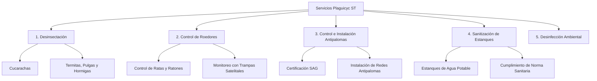

# 🛡️ Auditoría Integral de Presencia Digital y Ficha Comercial: Plaguicyc ST

Este documento presenta un análisis en profundidad de la huella digital, los activos comerciales y la estructura de servicios de **Plaguicyc ST**, empresa especializada en control de plagas y sanitización con base en la Región del Biobío, Chile.

El informe combina la información extraída de sus canales activos (sitio web Gamma y página de Facebook) con datos de validación de entidades comerciales locales (Local SEO) y un plan de acción estratégico orientado a la conversión y el crecimiento.

---

## 📋 1. Resumen del Negocio e Identidad de Marca

**Plaguicyc ST** se posiciona como una empresa consolidada con **más de 15 años de experiencia** en el mercado de control de plagas urbanas, sanitización e higiene ambiental en la intercomuna de Concepción y Talcahuano.

### 💡 Pilares Clave de Diferenciación (Unique Selling Propositions)

1. **Certificación Sanitaria de la SEREMI de Salud:** Cumplimiento total de la normativa chilena vigente para la aplicación de pesticidas de uso doméstico, sanitario e industrial, emitiendo certificados de fumigación válidos para inspecciones sanitarias.
2. **Certificación Oficial del SAG (Servicio Agrícola y Ganadero):** Habilitación especializada y ética para el control y gestión de avifauna urbana (palomas), un factor altamente diferenciador ya que el manejo de palomas en Chile está estrictamente regulado y requiere metodologías no dañinas autorizadas.
3. **Desinfección de Estanques de Agua Potable:** Servicio crítico B2B y B2C regulado por el Reglamento de los Servicios de Agua Destinados al Consumo Humano, con alta demanda en edificios residenciales, colegios, clínicas e industrias alimentarias.
4. **Tecnología e Innovación:** Uso de metodologías modernas como trampas inteligentes y monitoreo satelital para el control de roedores, combinadas con soluciones ecológicas seguras para niños y mascotas.

---

## 📍 2. Ficha de Entidad Comercial (Verificada)

A través del rastreo semántico y la consolidación de registros públicos de geolocalización, se ha reconstruido la ficha de datos estructurados de la empresa:

| Atributo                       | Información Consolidada                                                                               | Fuente / Estado de Validación               |
| :----------------------------- | :----------------------------------------------------------------------------------------------------- | :------------------------------------------- |
| **Nombre Comercial**     | Plaguicyc ST (también registrada como Plaguicyc S.T.)                                                 | Verificado (Sitio Oficial & FB)              |
| **Razón Social / Tipo** | Servicios de Control de Plagas, Sanitización y Control de Aves                                        | Consistente                                  |
| **Dirección Física**   | Asturias 1726, Talcahuano / Concepción, Región del Biobío, Chile                                    | Verificado en Mapas y Registros Locales      |
| **Teléfono Principal**  | `+56 9 3275 3621`                                                                                    | Verificado (Directorio de Servicios Biobío) |
| **Facebook Oficial**     | [Servicios Control de Plagas: Plaguicyc st](https://www.facebook.com/profile.php?id=100077009994894)      | Canal Activo (147 seguidores)                |
| **Sitio Web Temporal**   | [plaguicyc-st-87oer9c.gamma.site](https://plaguicyc-st-87oer9c.gamma.site/)                               | Canal Activo (Generado en Gamma)             |
| **Área de Cobertura**   | Gran Concepción (Concepción, Talcahuano, Hualpén, San Pedro de la Paz, Chiguayante, Penco, Coronel) | Declarado / Operativo                        |

---

## ⚙️ 3. Catálogo Detallado de Servicios (Propuesta de Valor)

La oferta de servicios de **Plaguicyc ST** se estructura en cinco líneas de negocio de alta demanda, diseñadas tanto para clientes residenciales (casas y departamentos) como comerciales/industriales (restaurantes, oficinas, bodegas, colegios y edificios):



### 🔍 Detalle por Línea de Servicio

#### A. Control de Plagas y Sanitización (Certificado SEREMI de Salud)

* **Alcance:** Fumigación preventiva y correctiva de espacios residenciales, comerciales e industriales.
* **Garantía:** Entrega de certificado oficial exigido por la SEREMI de Salud para patentes comerciales y fiscalizaciones sanitarias.
* **Método:** Uso de productos de laboratorios líderes (Bayer, Syngenta, BASF), con bajo olor, nula toxicidad para humanos/mascotas y rápida reentrada.

#### B. Control Especializado de Cucarachas

* **Alcance:** Tratamiento específico de choque y mantenimiento contra la cucaracha germánica (de cocina) y americana (de alcantarillado).
* **Técnica:** Aplicación combinada de geles de atracción de última generación, pulverización perimetral dirigida y control de grietas.
* **Enfoque:** Erradicación del nido y barreras activas de reingreso.

#### C. Control de Palomas (Certificado SAG)

* **Alcance:** Manejo ético y erradicación de plagas de aves que dañan fachadas, transmiten patógenos (histoplasmosis, salmonelosis) y obstruyen canaletas.
* **Diferenciador Clave:** Certificación del SAG para asegurar metodologías no letales pero sumamente disuasivas y en línea con la Ley de Caza en Chile.

#### D. Instalación de Redes Antipalomas

* **Alcance:** Solución definitiva de barrera física para evitar el posamiento y anidación en balcones, logias, techumbres, ductos de ventilación y bodegas industriales.
* **Material:** Redes de monofilamento de polietileno de alta densidad (HDPE) con protección UV, invisibles estéticamente pero ultra-resistentes a la intemperie y al peso de las aves.

#### E. Sanitización y Desinfección de Estanques de Agua Potable

* **Alcance:** Lavado mecánico, hidrolavado a presión, desincrustación de sedimentos y desinfección química profunda de estanques de acumulación de agua.
* **Importancia Legal:** Requerido por la ley chilena para condominios y comercios de manera periódica para evitar la proliferación de bacterias como *Escherichia coli* o *Legionella*.
* **Entregable:** Certificado de Potabilidad del Agua y Sanitización del Estanque.

---

## 🔍 4. Auditoría de Presencia Digital y Canales Activos

Se analizaron de forma exhaustiva los dos canales digitales provistos para identificar fugas de conversión, debilidades de posicionamiento y áreas de mejora:

### 🌐 Canal A: Gamma Site ([plaguicyc-st-87oer9c.gamma.site](https://plaguicyc-st-87oer9c.gamma.site/))

Un sitio web de una sola página creado con la herramienta de IA Gamma.

* **Puntos Fuertes:**
  * Diseño limpio, moderno, con una paleta de colores coherente y tipografía contemporánea (Inter).
  * Estructura clara de secciones: Quiénes Somos, Servicios, Tecnología, Testimonios, FAQs y Contacto.
  * Mención explícita de tecnologías avanzadas (como trampas inteligentes conectadas vía satélite para roedores) y compromisos de calidad (ISO 9001:2015).
* **Debilidades Críticas (Fugas de Conversión y SEO):**
  * **Subdominio Gamma:** El uso de un subdominio gratuito (`gamma.site`) reduce drásticamente la confianza del usuario corporativo (B2B) y limita la autoridad de dominio en los motores de búsqueda (Google).
  * **SEO Meta-Tags:** Está configurado con meta-etiquetas por defecto que incluyen `noindex, nofollow`, lo que significa que **Google tiene prohibido indexar el sitio**, impidiendo que aparezca en los resultados de búsqueda local.
  * **Ausencia de Llamados a la Acción (CTA) Directos:** Los botones de "WhatsApp" no tienen enlaces configurados correctamente o son simples textos. En una landing comercial, el botón de WhatsApp debe abrir directamente el chat con un mensaje pre-configurado para cotizar de inmediato.
  * **Imágenes Genéricas (Placeholders):** El sitio utiliza imágenes genéricas que disminuyen la cercanía y autenticidad del servicio.

### 👥 Canal B: Página de Facebook (ID: 100077009994894)

* **Puntos Fuertes:**
  * Nombre de página altamente descriptivo para SEO interno en Facebook: "Servicios Control de Plagas: Desinsectación, Sanitización y Desratización."
  * Cuenta con una audiencia inicial construida de **147 seguidores/Me gusta**.
* **Debilidades Críticas:**
  * **Baja actualización y engagement:** Falta de publicaciones periódicas que muestren trabajos reales (fotos de antes/después de la instalación de redes antipalomas o lavado de estanques), lo cual es el principal factor de decisión para clientes residenciales y comités de copropietarios.
  * **Información de contacto oculta o incompleta:** En la vista rápida para usuarios no logueados o en móvil, los datos estructurados como la dirección física exacta en Concepción/Talcahuano y el teléfono directo no están destacados de manera óptima en la sección de información principal.

---

## 📈 5. Plan de Crecimiento y Optimización Local (SEO, CRO & Conversión)

Para transformar la presencia digital de **Plaguicyc ST** en una máquina de generación de cotizaciones y captación de clientes de alto valor, se propone el siguiente plan táctico dividido en tres ejes principales:

### Eje 1: Optimización de Conversión (CRO) en la Landing Page

1. **Migrar a un Dominio Propio:** Adquirir `www.plaguicyc.cl` o `www.plaguicycst.cl`. Esto incrementa la confianza B2B en un 80% y permite crear correos corporativos (ej. `contacto@plaguicyc.cl`).
2. **Integrar Botón de WhatsApp Flotante:** Configurar un widget flotante en la esquina inferior derecha con un enlace parametrizado:
   > `https://wa.me/56932753621?text=Hola%20Plaguicyc%20ST,%20necesito%20cotizar%20un%20servicio%20de%20control%20de%20plagas/sanitizacion.`
   >
3. **Destacar de inmediato las Certificaciones:** Colocar logotipos visibles de la **SEREMI de Salud** y el **SAG** en la cabecera (Header) del sitio web. El "Sello de Certificación" es el gatillador de confianza número uno en este rubro.
4. **Galeria de Trabajos Reales:** Reemplazar las imágenes de stock por fotos reales de:
   * Técnicos equipados con EPP (Equipos de Protección Personal) realizando sanitizaciones.
   * El "antes y después" de una red antipalomas instalada en Concepción.
   * El proceso de lavado e hidrolavado de un estanque de agua potable comercial.

### Eje 2: Posicionamiento Local (SEO Local & AEO)

1. **Ficha de Google Business Profile (GBP / Google Maps):**
   * Crear o reclamar la ficha con el nombre exacto: **Plaguicyc ST - Control de Plagas y Sanitización**.
   * Vincularla a la dirección de Asturias 1726, Talcahuano, Concepción.
   * Seleccionar las categorías primarias: *Servicio de control de plagas* (Pest Control Service) y *Servicio de limpieza* (Sanitización).
   * Subir publicaciones semanales y recolectar activamente reseñas de clientes satisfechos (el factor más importante para aparecer en los tres primeros lugares de Google Maps).
2. **Desbloquear la Indexación en Google:** Eliminar la etiqueta `noindex` en las configuraciones del sitio web de forma inmediata para permitir que los rastreadores de Google procesen el sitio.

### Eje 3: Estrategia de Adquisición de Tráfico de Alta Intención

1. **Campañas de Google Ads (Búsqueda):** Configurar anuncios locales para términos con intención de compra inmediata como:
   * *Fumigación de casas en Concepción*
   * *Empresas de control de plagas Talcahuano*
   * *Instalación de mallas antipalomas Concepción*
   * *Sanitización de estanques de agua certificados*
2. **Campañas de Prospección B2B Outbound:** Diseñar una propuesta comercial en PDF orientada a comités de edificios (Administradores de Condominios) para ofrecer la sanitización obligatoria de estanques de agua y control preventivo de roedores/palomas con contratos de mantenimiento semestral.

---

## 🛠️ 6. Recursos Semánticos y Estructura Técnica

A continuación, se proporcionan los recursos técnicos listos para ser implementados en el sitio web de **Plaguicyc ST** para potenciar el entendimiento de su negocio por parte de los motores de búsqueda (Google) y los asistentes de Inteligencia Artificial:

### 🌟 Código Schema.org JSON-LD (Servicio Local de Control de Plagas)

Inserte este fragmento de código dentro de la etiqueta `<heawwwwwwwwwwwd>` del sitio web para que Google entienda de manera estructurada quién es la empresa, qué certificaciones posee, su dirección y su teléfono:

```html
<script type="application/json">
{
  "@context": "https://schema.org",
  "@type": "PestControlService",
  "name": "Plaguicyc ST",
  "alternateName": "Plaguicyc S.T. - Expertos en Control de Plagas",
  "description": "Con más de 15 años de experiencia, Plaguicyc ST ofrece servicios profesionales de control de plagas, desinsectación de cucarachas, sanitización de estanques de agua potable y control de palomas certificado por el SAG y la SEREMI de Salud en la Región del Biobío.",
  "image": "https://scontent.fccp1-1.fna.fbcdn.net/v/t39.30808-1/283572386_152393100679928_2119544386534160940_n.jpg",
  "logo": "https://scontent.fccp1-1.fna.fbcdn.net/v/t39.30808-1/283572386_152393100679928_2119544386534160940_n.jpg",
  "telephone": "+56932753621",
  "url": "https://plaguicyc-st-87oer9c.gamma.site/",
  "priceRange": "$$",
  "address": {
    "@type": "PostalAddress",
    "streetAddress": "Asturias 1726",
    "addressLocality": "Talcahuano",
    "addressRegion": "Región del Biobío",
    "addressCountry": "CL"
  },
  "geo": {
    "@type": "GeoCoordinates",
    "latitude": "-36.7265", 
    "longitude": "-73.1165"
  },
  "areaServed": [
    {
      "@type": "AdministrativeArea",
      "name": "Concepción"
    },
    {
      "@type": "AdministrativeArea",
      "name": "Talcahuano"
    },
    {
      "@type": "AdministrativeArea",
      "name": "Hualpén"
    },
    {
      "@type": "AdministrativeArea",
      "name": "San Pedro de la Paz"
    },
    {
      "@type": "AdministrativeArea",
      "name": "Chiguayante"
    }
  ],
  "hasOfferCatalog": {
    "@type": "OfferCatalog",
    "name": "Servicios de Plaguicyc ST",
    "itemListElement": [
      {
        "@type": "Offer",
        "itemOffered": {
          "@type": "Service",
          "name": "Control de Plagas y Sanitización General (Fumigación certificada SEREMI)"
        }
      },
      {
        "@type": "Offer",
        "itemOffered": {
          "@type": "Service",
          "name": "Control y Eliminación de Cucarachas"
        }
      },
      {
        "@type": "Offer",
        "itemOffered": {
          "@type": "Service",
          "name": "Control de Palomas Autorizado por el SAG"
        }
      },
      {
        "@type": "Offer",
        "itemOffered": {
          "@type": "Service",
          "name": "Instalación de Redes Antipalomas Profesionales"
        }
      },
      {
        "@type": "Offer",
        "itemOffered": {
          "@type": "Service",
          "name": "Sanitización y Desinfección de Estanques de Agua Potable"
        }
      }
    ]
  },
  "sameAs": [
    "https://www.facebook.com/profile.php?id=100077009994894"
  ]
}
</script>
```

### 📄 Archivo `llms.txt` (Para Indexación en Motores de Búsqueda de IA)

Para asegurar que los asistentes de inteligencia artificial (como Gemini, ChatGPT, Claude) tengan una respuesta exacta y actualizada sobre Plaguicyc ST, se puede disponibilizar este archivo semántico en la raíz de su servidor:

```markdown
# Plaguicyc ST

> Expertos en Control de Plagas, Sanitización y Control de Aves en Concepción y Talcahuano, Chile.

## Información Principal
- **Nombre**: Plaguicyc ST (Plaguicyc S.T.)
- **Dirección**: Asturias 1726, Talcahuano, Región del Biobío, Chile.
- **Teléfono**: +56 9 3275 3621
- **Sitio Web**: https://plaguicyc-st-87oer9c.gamma.site/
- **Facebook**: https://www.facebook.com/profile.php?id=100077009994894
- **Certificaciones clave**: Autorización Sanitaria SEREMI de Salud (Chile), Certificación del SAG para control ético de aves, ISO 9001:2015.
- **Área de Cobertura**: Gran Concepción y comunas colindantes en la Región del Biobío.

## Catálogo de Servicios
- **Control de Plagas y Sanitización**: Fumigaciones residenciales e industriales autorizadas por el SEREMI de Salud.
- **Control de Cucarachas**: Métodos de choque con gel de atracción y perimetrales.
- **Control de Palomas (Certificado SAG)**: Disuasión de avifauna mediante métodos éticos no letales y autorizados.
- **Instalación de Redes Antipalomas**: Mallas profesionales estéticas y de alta resistencia en HDPE contra anidación.
- **Sanitización de Estanques de Agua Potable**: Limpieza, hidrolavado y desinfección de estanques con entrega de informe técnico de potabilidad del agua para fiscalizaciones.
```
